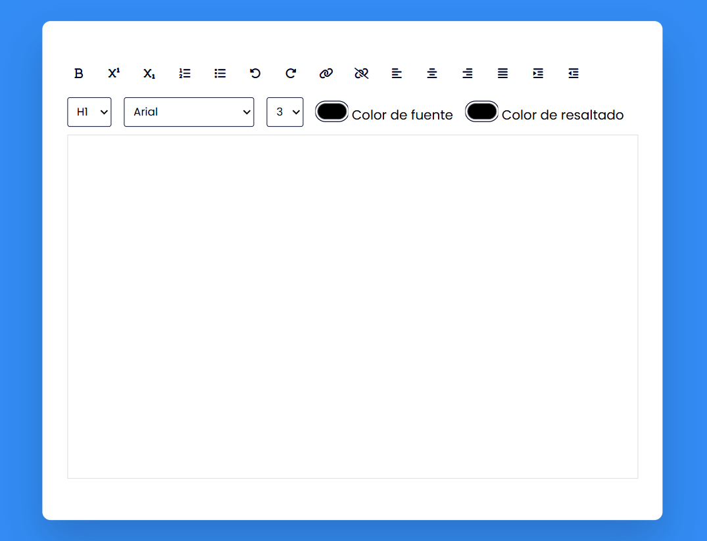

# 📝 Editor de Texto Rich 

Un editor de texto enriquecido con múltiples opciones de formato. Este es el proyecto #2 de mi desafío personal de [100 días de JavaScript](https://github.com/gianmattus-programmer/100-DIAS-DE-JS).

✨ Características

- 📝 Formato de texto (negrita, subíndice, superíndice)
- 📋 Listas ordenadas y desordenadas
- ↩️ Deshacer/Rehacer cambios
- 🔗 Insertar/eliminar enlaces
- ⚡ Alineación de texto
- 🎨 Personalización de colores
- 📊 Diferentes tamaños y tipos de fuente
- 📱 Diseño responsivo

## 🚀 Demo en vivo

[¡Prueba el generador aquí!](https://rich-text-editor-gianmattus-programmers-projects.vercel.app) 

## 💻 Guía rápida de uso

<table>
<tr>
<td>

### 📝 Formato Básico
- Uso de botones de formato
- Selección de fuentes
- Ajuste de tamaño

</td>
<td>

### 🎨 Personalización
- Selector de color de texto
- Color de fondo
- Alineación de texto

</td>
</tr>
</table>

## 🛠️ Funcionalidades

| Categoría | Opciones |
|-----------|----------|
| Texto | Negrita, Subíndice, Superíndice |
| Listas | Ordenadas, No ordenadas |
| Enlaces | Crear, Eliminar |
| Alineación | Izquierda, Centro, Derecha, Justificado |
| Color | Texto, Resaltado |

## 🌟 Autor

**[@Gianmattus-Programmer](https://github.com/Gianmattus-Programmer)**

